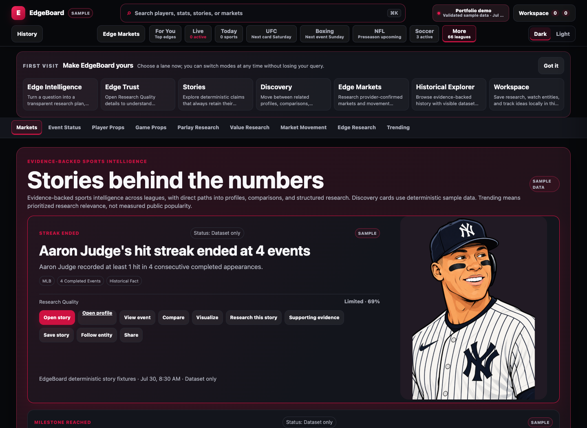
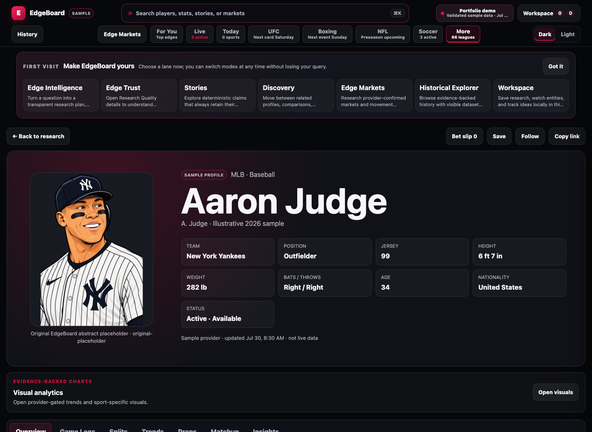
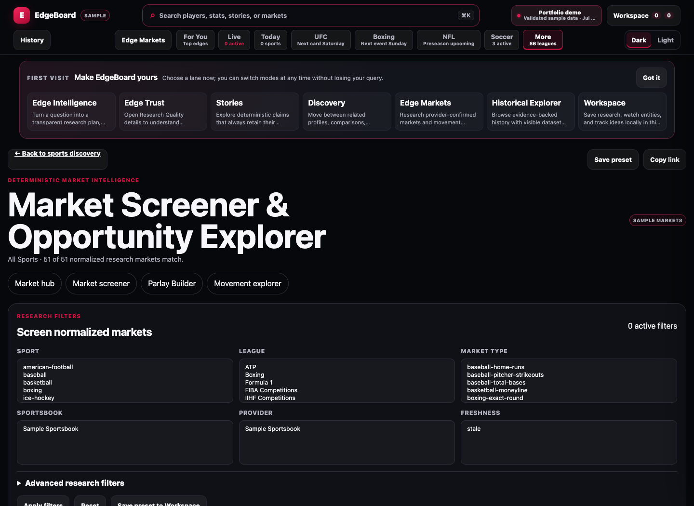
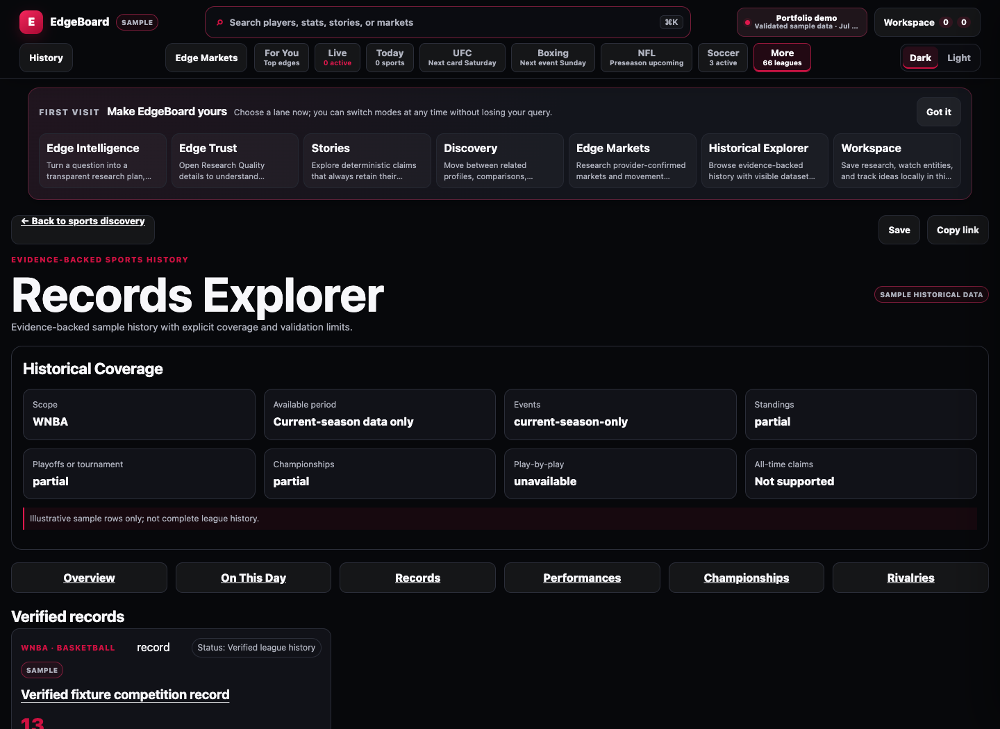

# EdgeBoard Sports Stats

EdgeBoard is a portfolio-scale sports research application that turns normalized sample data into athlete profiles, statistical comparisons, market research, historical exploration, visual analytics, and saved research workflows. It demonstrates product thinking, frontend architecture, deterministic analysis, backend boundaries, accessibility, and verification—not sample fixtures presented as live sports data.

[Live Demo](https://edgeboard-sports-stats.onrender.com/) · [Repository](https://github.com/OYN-droid/Edgeboard-Sports-Stats) · [API contract](docs/openapi.json) · [Architecture notes](docs/getting-started.md) · [Illustration system](docs/illustration-system.md)

## Demo

Open the verified public portfolio deployment: [Live Demo](https://edgeboard-sports-stats.onrender.com/).

To run the complete credential-free demo locally:

```bash
git clone https://github.com/OYN-droid/Edgeboard-Sports-Stats.git
cd Edgeboard-Sports-Stats
python3 -m server.app --port 9010
```

Open [http://127.0.0.1:9010](http://127.0.0.1:9010). Python 3.12+ is recommended; the default sample experience has no third-party Python package requirement.

## Screenshots

| Sports discovery and research | Athlete intelligence |
| --- | --- |
|  |  |

| Market research | Historical Explorer |
| --- | --- |
|  |  |

All screenshots show the repository's current sample-mode launch candidate. They do not depict a live provider connection.

## What the project demonstrates

- A normalized multi-sport domain spanning leagues, teams, athletes, events, statistics, markets, history, and entity relationships.
- Deterministic research planning, comparisons, qualification rules, evidence identity, counterarguments, and confidence labels without presenting generated prose as source data.
- A provider-neutral boundary with explicit fixture, shadow, limited-live, and certified-live states; sample mode is the public default.
- Shareable routes, accessible data tables and visualizations, responsive layouts, light/dark themes, and local-only workspace persistence.
- Fail-closed production configuration, same-origin API serving, readiness checks, migration tooling, rollout controls, and credential-free CI.
- An original illustration registry with canonical entity mapping, deterministic fallbacks, provenance records, immutable production hashes, and portable validators.

## Product experiences

EdgeBoard's primary paths are designed to work together:

1. **Discover** a sport, league, story, athlete, team, or market from the scoped home experience.
2. **Research** with Stats, Betting, or Both mode while retaining evidence, qualification rules, freshness, and sample/live labels.
3. **Inspect entities** through athlete and team profiles, connected relationships, historical context, visualizations, and market-compatible views.
4. **Evaluate markets** through the Market Screener, price comparison, market movement, Parlay Builder, correlation warnings, Edge Trust, and Research Quality.
5. **Save work locally** in boards, watchlists, tracked ideas, research sessions, and alerts without requiring an account or cloud service.

Additional showcase surfaces include Historical Explorer, On This Day, record books, story intelligence, Edge Lab scenarios, and the connected sports knowledge graph.

## Architecture

```text
Browser SPA
  ├─ views, accessible components, routing, workspace
  ├─ normalized research / entity / market / history services
  ├─ canonical registries and deterministic illustration resolver
  └─ sample fixture provider (default)
                 │ same-origin /api/*
Python application server
  ├─ static and SPA route serving
  ├─ public config, status, readiness, provider gateway
  ├─ validation, caching, rollout and security boundaries
  └─ optional provider adapters (disabled by default)
                 │
SQLite persistence and migrations
```

The browser remains provider-neutral: adapters normalize external responses before consumer code can see them. Public labels come from validated runtime state, not a UI toggle. See [provider integration](docs/provider-integration.md), [statistical research](docs/statistical-research.md), [entity intelligence](docs/entity-intelligence.md), and [visual analytics](docs/visual-analytics.md).

## Data and trust model

The default dataset is a recorded, deterministic sample used for product demonstration and regression testing. It is not a live scoreboard, sportsbook feed, or comprehensive historical database. Provider scaffolding exists behind explicit configuration and certification controls, but the portfolio deployment keeps every league `fixture_only` and disables live data, live odds, AI explanations, alerts, cloud sync, and provider proof-of-concept access.

EdgeBoard distinguishes source quality, research completeness, deterministic signal strength, and freshness. Confidence is not represented as win probability, and recency is never implied without timestamp/status evidence.

## Original illustration coverage

The active portrait registry currently contains:

| League | Active exact portraits |
| --- | ---: |
| MLB | 30 |
| NBA | 30 |
| WNBA | 8 |
| NFL | 5 |
| UFC | 10 |
| Boxing | 13 |

These counts are derived from the canonical registry and checked by repository-portable validation. Missing exact art resolves through approved team, competition, weight-class, sport, and neutral fallbacks. Historical source-export paths remain in provenance records when useful, but validation never requires a contributor's Downloads folder: committed production assets, expected hashes, canonical mappings, approval state, alpha channels, and dimensions remain strict.

## Verification

Run the same credential-free gates used by CI:

```bash
python3 -m unittest discover -s tests -v
python3 scripts/validate_portable_illustrations.py
python3 scripts/run_browser_regression.py
```

The browser command starts an isolated sample-mode server and headless Chrome session, then runs all 25 browser suites. CI also compiles Python, validates production configuration, applies migrations, runs API and rollout smoke tests, scans committed content for credential patterns, and checks diff hygiene.

Individual browser harnesses remain inspectable at `/browser-tests/<suite>.html`, including `full-regression.html`, `athlete-profiles.html`, `market-screener.html`, `research-analyst.html`, `visualizations.html`, and `launch-readiness.html`.

Portrait delivery assets can be regenerated with `python3 scripts/optimize_portraits.py` after installing Pillow. This is an optional development-time optimization tool; Pillow is not imported by the application server and is not required for the standard-library-only sample experience.

## Production configuration and deployment

Validate configuration and simulate the production boundary locally:

```bash
EDGEBOARD_ENV=production \
EDGEBOARD_DATA_MODE=sample \
SAMPLE_MODE=true \
SAMPLE_MODE_ENABLED=true \
APP_BASE_URL=http://127.0.0.1:10000 \
ALLOWED_ORIGINS=http://127.0.0.1:10000 \
PORT=10000 \
python3 -m server.app --check-config
```

The Render Blueprint defines one Python web service. Its build compiles the server and scripts; its start command serves the SPA, assets, and relative API routes from one origin. Readiness is exposed at `/api/status/ready`. Set `APP_BASE_URL` and `ALLOWED_ORIGINS` to the final HTTPS origin during deployment; do not add provider credentials for the sample portfolio deployment.

Optional environment settings are documented in [`.env.example`](.env.example). Secrets belong in the deployment environment, never in browser code or committed files.

## Repository map

```text
.
├── assets/illustrations/    # original production art and fallback library
├── browser-tests/           # deterministic in-browser regression harnesses
├── docs/                    # architecture, provenance, API, and screenshots
├── scripts/                 # validation, migration, smoke, and audit tools
├── server/                  # Python app, API, config, storage, provider boundary
├── src/                     # SPA components, services, registries, and data
├── tests/                   # Python unit and integration regression
├── index.html               # application shell
└── render.yaml              # production deployment blueprint
```

## Five-minute recruiter walkthrough

1. Start the app and confirm the **Sample data** disclosure in the header/status surfaces.
2. Use scoped discovery, then open **Aaron Judge** to inspect the profile, evidence-backed insights, visuals, history, relationships, and illustration fallback behavior.
3. Run a Stats comparison and switch to Both mode to see statistical evidence remain distinct from market context.
4. Open **Market Screener** and **Parlay Builder** to inspect price/freshness metadata, quality gates, counterarguments, and correlation warnings.
5. Save research to the local workspace, switch themes, narrow to a mobile viewport, and refresh a shareable route.
6. Review the verification commands above and the CI workflow in [`.github/workflows/ci.yml`](.github/workflows/ci.yml).

## Current limitations

- The public demo is sample-first; optional provider adapters are not configured or certified for public live use.
- Fixture coverage is intentionally representative rather than exhaustive across every league, season, market, and historical record.
- Workspace data is local to the browser. There are no accounts, cloud synchronization, push alerts, or multi-user collaboration.
- Illustrations are selective and use explicit fallbacks outside the active exact-portrait set.
- No open-source license is currently declared. Repository visibility does not grant reuse rights by default.

## Further reading

- [Getting started and launch boundary](docs/getting-started.md)
- [Launch readiness and rollback](docs/launch-readiness.md)
- [Security and production boundary](docs/live-data-backend-security.md)
- [Athlete profiles](docs/athlete-profiles.md)
- [Historical Explorer](docs/historical-explorer.md)
- [Connected sports knowledge graph](docs/connected-knowledge-graph.md)
- [Workspace architecture](docs/personal-workspaces.md)
